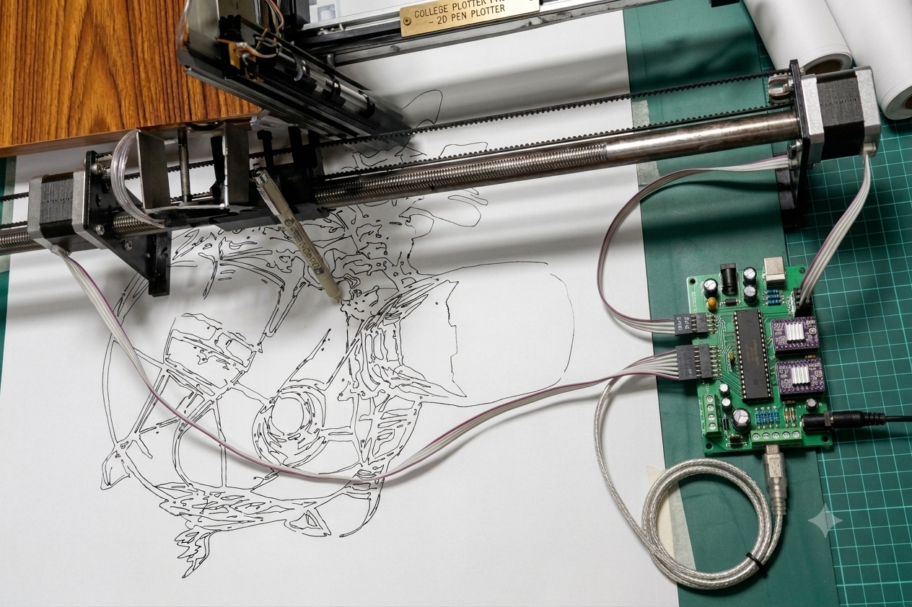

# Open-Loop CNC Pen Plotter (2015)

An end to end electromechanical CNC Pen Plotter system originally developed as a college robotics project in 2015. 

This project bridges a custom Windows desktop application with bare-metal AVR microcontroller firmware to parse G-code and control physical hardware over a wireless Bluetooth connection. It serves as a comprehensive example of full-stack embedded system design, from the Win32 UI and serial APIs down to custom Bresenham-based stepper motor interpolation.

## 🛠️ Architecture Overview

The system is divided into two primary environments:

1. **Windows Desktop Application (C++ / Win32 API):** A G-code parsing and transmission utility. It automatically brute-forces available COM ports to find the plotter, establishes a wireless Bluetooth data link, reads `.gcode` files sequentially, and handles hardware synchronization.
2. **Firmware (Bare-Metal C / ATmega32 or ATmega8):** Embedded control system utilizing a custom Bresenham-style linear interpolation algorithm for precise multi-axis stepper motor coordination, alongside software-timed PWM for hobby servo pen actuation.

## 🧠 Engineering Philosophy

### 1. Synchronous Open-Loop Motion Control
Standard stepper motors and hobby servos operate without optical encoders or positional feedback loops. Because the physical hardware cannot report back when it has reached its destination, the firmware uses a deliberate, **synchronous timing model**. 

Instead of relying on complex background timer interrupts, the microcontroller calculates precise steps and utilizes blocking timing delays (`_delay_us`) during axis movement. This deterministic approach guarantees that the CPU halts and the mechanical parts have physically completed their travel before the system accepts the next G-code instruction.

### 2. Reliable RF Protocol via HC-05
The system uses a standard HC-05 Bluetooth module, which acts as a transparent UART to Bluetooth bridge. To prevent buffer overruns and data corruption in a wireless RF environment, the software implements a strict, character-by-character validation protocol:
* The desktop app sends a single byte.
* The ATmega firmware receives it and transmits `byte + 1` back as an acknowledgment.
* The desktop app blocks until it receives this exact echo before sending the next character.
* At the end of a G-code line, a `#` delimiter is sent, invoking a 20-second timeout guard while waiting for a `# + 1` confirmation to ensure the physical line was drawn before proceeding.

## 🔌 Hardware Setup & Pin Mapping

The firmware is designed for an ATmega32 (or ATmega8) running at 16MHz.

| Component | Axis/Function | ATmega Pin | Notes |
| :--- | :--- | :--- | :--- |
| **Stepper Driver** | X-Axis Step | `PD7` (OC2) | Controls X-axis movement |
| **Stepper Driver** | X-Axis Dir | `PD3` | Controls X-axis direction |
| **Stepper Driver** | X-Axis Enable | `PC3` | Motor enable/disable |
| **Limit Switch** | X-Axis Min | `PC4` | Origin homing (Pull-up) |
| **Stepper Driver** | Y-Axis Step | `PB3` (OC0) | Controls Y-axis movement |
| **Stepper Driver** | Y-Axis Dir | `PD6` | Controls Y-axis direction |
| **Stepper Driver** | Y-Axis Enable | `PD4` | Motor enable/disable |
| **Limit Switch** | Y-Axis Min | `PC5` | Origin homing (Pull-up) |
| **Hobby Servo** | Pen Up/Down | `PD5` | Software PWM driven |
| **HC-05 Bluetooth**| UART RX / TX | `PD0` / `PD1` | 38400 Baud Rate |

## 🚀 Usage & Execution

### Building the Desktop App
The Windows application relies on legacy Win32 APIs and standard C++ libraries (`Kernel32.lib`, `winmm.lib`). It can be compiled using Microsoft Visual Studio.
* Run the executable. It will automatically scan `COM0` through `COM19` to find the HC-05 module and cache the successful port to your `D:/` or `E:/` drive for faster future connections.
* Load a `.gcode` file via the UI, or switch to the interactive CLI mode.

### Flashing the Firmware
The firmware is standard bare-metal AVR C.
* Define your MCU (`atMega32` or `atMega8`) and clock speed (`16000000UL`) in `plottertest.cpp`.
* Compile using `avr-gcc` (or Microchip Studio/AVR Studio) and flash the `.hex` file to the microcontroller via your preferred ISP programmer.

  

